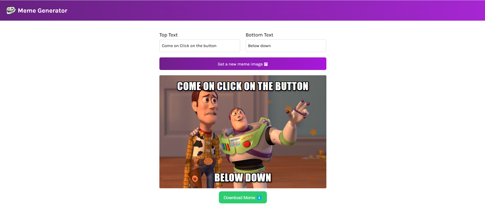

# Meme Generator App 😂

A fun React-based meme generator that lets users pick random meme images and overlay custom top and bottom text.

## 🔧 Tech Stack
- React.js
- JavaScript
- HTML/CSS

## ✨ Features
- Random meme image selection
- Custom top & bottom text
- Responsive layout

## 🚀 How to Use
1. Enter top and bottom text
2. Click "Get a new meme image 🖼"
3. Laugh and repeat 😂

## 📁 Folder Highlights
- `App.js` – Main container
- `Meme.js` – Handles meme generation logic
- `memeData.js` – Static meme templates

## 🔗 Live Demo
👉 [Click to try it](https://meme-generator-myreactappchirag.netlify.app)

## 📸 Screenshot
<!-- You can upload a screenshot here later -->

## 📬 Contact
**H M Chirag**  
📧 chiragshettyhm@gmail.com
